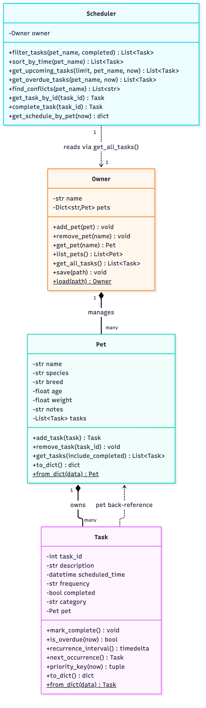

# PawPal+

A smart pet care management system. Tracks feedings, walks, medications, and
appointments across multiple pets, and uses a priority-based scheduling
algorithm to surface what needs attention first.

## Features

- **Priority-ranked daily schedule** -- `Scheduler.get_upcoming_tasks()` /
  `get_overdue_tasks()` rank every pending task by overdue status first,
  then category urgency (medication > appointment > feeding > walk), then
  soonest due time, so the single most important thing to do next is
  always at the top. (`pawpal_system.py`)

- **Sorting by time** -- `Scheduler.sort_by_time()` returns tasks in pure
  chronological order, ignoring category weight, for a plain "what's next"
  view. (`pawpal_system.py`, surfaced in the "Sorted by Time" tab of
  `app.py`)

- **Filtering by pet or completion status** --
  `Scheduler.filter_tasks(pet_name=..., completed=...)` narrows the task
  list to one pet, a completion status, or both. Every other query method
  is itself built on top of this one filter. (`pawpal_system.py`, the
  "Filter" tab of `app.py`)

- **Conflict warnings** -- `Scheduler.find_conflicts()` detects when two
  tasks -- for the same pet or different pets -- are scheduled at the
  exact same time, and returns a human-readable warning instead of ever
  raising. Surfaced live at the top of the Streamlit dashboard.
  (`pawpal_system.py`, `app.py`; tradeoffs discussed in `reflection.md`
  section 2b)

- **Daily / weekly / monthly recurrence** -- `Task.next_occurrence()` and
  `Scheduler.complete_task()` automatically create a recurring task's next
  instance the moment it's marked done, anchored to the task's *original*
  scheduled time so a late completion doesn't drift the schedule.
  Completing an already-completed task is guarded against, so it can
  never silently double-book a duplicate occurrence. (`pawpal_system.py`)

- **Multi-pet household support** -- `Owner.get_all_tasks()` aggregates
  every pet's tasks into one collection, and `Scheduler` always queries
  through this method rather than any single `Pet`, so ranking, sorting,
  filtering, and conflict detection are all correct across any number of
  pets. (`pawpal_system.py`)

- **Persistent storage** -- `Owner.save()` / `Owner.load()` round-trip an
  entire household (pets and their tasks) to and from JSON, so data
  survives between runs of the app. (`pawpal_system.py`; used by `app.py`
  to persist to `data/pawpal.json`)

- **Streamlit dashboard** -- a browser UI with a live metrics summary
  (pets / pending tasks / overdue / conflicts), forms to add pets and
  tasks, and three views (Priority Schedule, Sorted by Time, Filter) built
  directly on the `Scheduler` methods above -- the UI never re-implements
  ranking or filtering itself. (`app.py`)

## Implementation Summary

The core (`pawpal_system.py`) is four small classes that each do one job and
compose into the whole system. A **Task** is the atomic unit -- a
description, a scheduled time, a frequency, and a completion flag. A **Pet**
just owns a list of its own `Task`s. An **Owner** owns a household of `Pet`s
and exposes `get_all_tasks()`, which flattens every pet's list into one
combined collection. The **Scheduler** is the only class that does any
"thinking": it never reaches into a `Pet` directly, it always asks the
`Owner` for the full task list via `get_all_tasks()`, then ranks whatever
comes back by overdue status, category urgency (medication > appointment >
feeding > walk), and soonest due time. That one indirection --
Scheduler → Owner → Pet -- is what makes the ranking correct across an
arbitrary number of pets instead of just one, and it's what
`tests/test_owner.py` and `tests/test_scheduler.py` exercise directly.

The rest of the system builds on top of that core without changing it:
`main.py` is a CLI script that wires up a sample `Owner`/`Pet`s/`Task`s and
prints the `Scheduler`'s ranked output, used to verify the logic works
before any UI touches it, and the `pytest` suite in `tests/` locks in that
same behavior (completion, overdue detection, recurrence, multi-pet
aggregation, and priority ranking) so future changes can't silently break
it.

## Architecture

Core logic lives in `pawpal_system.py`, with four classes:

- **Task** -- a single activity: description, scheduled time, frequency
  (`once`/`daily`/`weekly`/`monthly`), completion status, and a category used
  for priority weighting.
- **Pet** -- a pet's details plus the list of `Task`s that belong to it.
- **Owner** -- manages multiple `Pet`s. `get_all_tasks()` flattens every
  pet's tasks into one collection.
- **Scheduler** -- the "brain." It reads `Owner.get_all_tasks()` (never a
  single `Pet` directly) and ranks pending tasks by: overdue status, then
  category urgency (medication > appointment > feeding > walk), then
  soonest due time. It also handles marking tasks complete and
  auto-rescheduling recurring ones.

`main.py` is the CLI testing ground used to verify this logic works before
any UI is built on top of it.

### UML Diagram



Source: [`diagrams/uml_final.mmd`](diagrams/uml_final.mmd) (Mermaid class
diagram). The composition arrows (filled diamonds) show `Owner *-- Pet` and
`Pet *-- Task` -- pets and tasks are owned outright, not shared -- while the
dashed arrows show `Scheduler ..> Owner` (queries through `get_all_tasks()`
only) and `Task ..> Pet` (the back-reference set by `Pet.add_task()`).

## Smarter Scheduling

Beyond basic priority ranking, `Scheduler` implements four specific
behaviors:

- **Sorting by time** -- `Scheduler.sort_by_time(pet_name=None)` returns
  pending tasks ordered purely by `scheduled_time`, earliest first,
  ignoring category weight entirely. Useful when you just want "what's
  next chronologically" rather than a priority-weighted view.

- **Filtering by pet or completion status** --
  `Scheduler.filter_tasks(pet_name=None, completed=None)` narrows the full
  task list by either or both criteria (e.g. `completed=True` for a
  history view, `pet_name="Rex", completed=False` for one pet's open
  tasks). Both filters are optional and combine, and every other query
  method (`get_upcoming_tasks`, `sort_by_time`, `get_overdue_tasks`) is
  itself built on top of this one filter.

- **Conflict detection** -- `Scheduler.find_conflicts(pet_name=None)`
  groups pending tasks by exact `scheduled_time` and returns a
  human-readable warning string for every time slot with two or more
  tasks in it (whether for the same pet or different pets). It never
  raises -- an empty list just means no conflicts -- since a scheduling
  clash is a heads-up for the owner, not a program error. See
  `reflection.md` section 2b for the tradeoff this design makes
  (exact-time matches only, not overlapping durations).

- **Recurring task logic** -- `Task.next_occurrence()` builds the next
  instance of a `daily`/`weekly`/`monthly` task by adding a fixed
  `timedelta` to its *original* `scheduled_time` (not the completion
  time, so a late completion doesn't drift the schedule).
  `Scheduler.complete_task(task_id)` calls this automatically whenever a
  recurring task is marked done, appending the new occurrence to the same
  pet so it shows up in the very next query.

## Running the App

```
pip install -r requirements.txt
streamlit run app.py
```

Opens PawPal+ in your browser at `http://localhost:8501`. Add a pet in the
sidebar, then add tasks from the "Add a Task" form -- the dashboard
metrics, conflict warnings, and all three views (Priority Schedule, Sorted
by Time, Filter) update live from the same `Scheduler` you can see exercised
in `main.py` and `tests/`. Data is saved automatically to
`data/pawpal.json` (gitignored) and reloaded the next time you start the
app.

## Running the CLI demo

```
python main.py
```

## Testing PawPal+

```
pip install -r requirements.txt
python -m pytest
```

`tests/` has one file per core class (`test_task.py`, `test_pet.py`,
`test_owner.py`, `test_scheduler.py`), 40 tests total, all passing. Coverage
includes:

- **Sorting correctness** -- tasks come back in true chronological order
  from `sort_by_time()`, regardless of category or insertion order
  (`test_sort_by_time_ignores_category_and_overdue_status`).
- **Recurrence logic** -- completing a `daily` task creates a new one
  scheduled for exactly the following day
  (`test_complete_task_marks_done_and_reschedules_recurring_task`), and
  completing an *already-completed* task raises instead of silently
  spawning a duplicate occurrence
  (`test_complete_task_raises_if_already_completed_and_does_not_double_recur`).
- **Conflict detection** -- `find_conflicts()` flags two tasks at the exact
  same time, whether for the same pet or different pets
  (`test_find_conflicts_detects_same_pet_double_booking`,
  `test_find_conflicts_detects_same_time_across_different_pets`), and
  correctly reports no conflicts once completed tasks are excluded.
- **Multi-pet aggregation and priority ranking** -- `Owner.get_all_tasks()`
  correctly combines every pet's tasks, and `Scheduler` ranks overdue
  status above category urgency above soonest due time.
- **Persistence** -- an `Owner` (with pets and tasks) round-trips through
  `save()`/`load()` without losing data.

Run `python main.py` alongside the tests for a terminal-visible sanity
check of the same behavior -- see Sample Output below.

### Test run output

```
============================= test session starts ==============================
platform darwin -- Python 3.11.6, pytest-9.1.1, pluggy-1.6.0
rootdir: /Volumes/T7Shield/CodePath/AppliedAI/AI110/week4/Project/PawPal+
configfile: pytest.ini
testpaths: tests
plugins: anyio-4.8.0
collected 40 items

tests/test_owner.py .....                                                [ 12%]
tests/test_pet.py .....                                                  [ 25%]
tests/test_scheduler.py .....................                            [ 77%]
tests/test_task.py .........                                             [100%]

============================== 40 passed in 0.03s ==============================
```

### Confidence Level

Confidence Level: ★★★★☆ (4/5)

The core logic -- sorting, filtering, recurrence, conflict detection,
multi-pet aggregation, and persistence -- is well covered and every test
passes deterministically (fixed `now` fixture, no reliance on real clock
time or randomness). I'm not giving 5/5 because coverage is at the unit
level only: there's no test yet exercising the system the way a real user
would end-to-end (add a pet, add several tasks, complete some, reload from
disk, all in one flow), and known simplifications like exact-time-only
conflict detection and the fixed 30-day "monthly" interval (see
`reflection.md` section 2b) mean the system is reliable for what it
promises, not for every real-world scheduling nuance.

## Demo Walkthrough

### Main UI features and what you can do

Launching the app (`streamlit run app.py`) opens a dashboard where you can:

- **Add a pet** from the sidebar form (name, species, breed, age).
- **Add a task** for any pet from the "Add a Task" form (description,
  date, time, category, and frequency -- `once`/`daily`/`weekly`/`monthly`).
- **View a live metrics dashboard** -- pet count, pending tasks, overdue
  count, and active conflicts, updating immediately after any change.
- **See conflict warnings** at the top of the page whenever two tasks land
  on the exact same time.
- **Browse three views**, each a thin wrapper over one `Scheduler` method:
  *Priority Schedule* (overdue vs. upcoming, ranked), *Sorted by Time*
  (pure chronological order), and *Filter* (by pet and/or completion
  status).
- **Mark a task complete** from a dropdown + button under any task table --
  recurring tasks automatically reschedule their next occurrence.

### Example workflow

1. **Add a pet** -- type "Rex", species "Dog", in the sidebar, click
   *Add Pet*. Rex now appears in the sidebar pet list.
2. **Schedule a task** -- in "Add a Task," pick Rex, type "Breakfast,"
   set today's date and an early time, category `feeding`, frequency
   `daily`, click *Add Task*.
3. **View today's schedule** -- the *Priority Schedule* tab immediately
   shows Breakfast under **Overdue** or **Upcoming** depending on the
   time you picked, and the dashboard's "Pending Tasks" metric increments
   by one.
4. **Add a second, colliding task** -- add another task for any pet at
   that exact same time; a conflict warning appears at the top of the
   page naming both tasks.
5. **Mark Breakfast complete** -- use the "Mark a task complete" dropdown
   under the Overdue table and click *Mark Done*. Breakfast disappears
   from the pending views, and because it was `daily`, a new "Breakfast"
   task appears scheduled exactly 24 hours later.

### Key Scheduler behaviors shown

- **Priority ranking** -- overdue tasks always sort above upcoming ones;
  among non-overdue tasks, category urgency (medication > appointment >
  feeding > walk) breaks ties before time does.
- **Sorting by time** -- the *Sorted by Time* tab shows the same tasks in
  pure chronological order, ignoring category, so you can see the
  difference from priority ranking directly.
- **Conflict warnings** -- two tasks at the same instant produce a
  warning naming both, whether they belong to the same pet or different
  pets, and the warning disappears the moment the collision is resolved.
- **Daily recurrence** -- completing a `daily`/`weekly`/`monthly` task
  spawns its next occurrence automatically, anchored to the original
  time rather than to whenever it was actually completed.
- **Filtering** -- narrowing by pet, by completion status, or both, all
  through the one `filter_tasks()` method every other view is built on.

### Sample CLI output (`python main.py`)

The same behaviors above are also verifiable straight from the terminal,
without the UI, via the CLI test script:

```
============================================================
  PawPal+ -- Today's Schedule                               
============================================================
Owner: Jordan    Pets: Rex, Milo

OVERDUE (1)
-----------
  #2   Rex      feeding     Mon 10:35 PM Breakfast: chicken & rice

UPCOMING (4)
------------
  #4   Rex      medication  Tue 01:35 AM Heartworm pill
  #5   Milo     appointment Tue 01:35 AM Vet checkup
  #3   Milo     feeding     Tue 07:35 AM Wet food dinner
  #1   Rex      walk        Tue 05:35 AM Evening walk around the block

------------------------------------------------------------
Total pending: 5   Overdue: 1
============================================================
  Sorting & Filtering Checks                                
============================================================

ALL PENDING TASKS -- sort_by_time() (5)
---------------------------------------
  #2   Rex      feeding     Mon 10:35 PM Breakfast: chicken & rice
  #4   Rex      medication  Tue 01:35 AM Heartworm pill
  #5   Milo     appointment Tue 01:35 AM Vet checkup
  #1   Rex      walk        Tue 05:35 AM Evening walk around the block
  #3   Milo     feeding     Tue 07:35 AM Wet food dinner

Completing task #2 (Breakfast: chicken & rice)...
  -> recurring task auto-rescheduled: new task #6 at Tue 10:35 PM

COMPLETED TASKS -- filter_tasks(completed=True) (1)
---------------------------------------------------
  #2   Rex      feeding     Mon 10:35 PM Breakfast: chicken & rice

REX'S PENDING TASKS -- filter_tasks(pet_name='Rex', completed=False) (3)
------------------------------------------------------------------------
  #1   Rex      walk        Tue 05:35 AM Evening walk around the block
  #4   Rex      medication  Tue 01:35 AM Heartworm pill
  #6   Rex      feeding     Tue 10:35 PM Breakfast: chicken & rice

CONFLICT CHECK -- find_conflicts()
-----------------------------------
  WARNING: Scheduling conflict at 2026-09-29 01:35 AM: Rex's 'Heartworm pill', Milo's 'Vet checkup'
```

Screenshots of the Streamlit UI can be added here for human reviewers, but
this text walkthrough and the CLI output above are what make the demo
gradable without needing to run anything.
